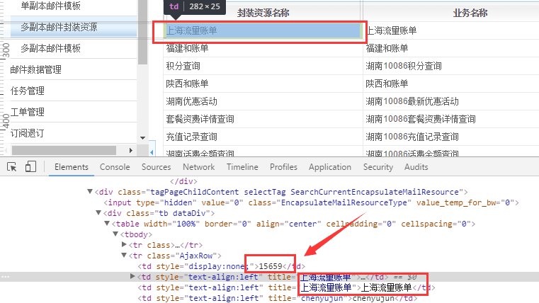
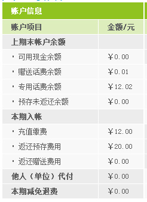

项目github地址：https://github.com/HelloWorld20/mail-tools

##如何找到封装资源ID

投递平台生产线=》模板管理=》多副本邮件封装资源=》打开控制台=》选中需要的业务，封装资源ID在封装资源名称的前面，只是被隐藏起来而已。具体如下图：

##双层柱状图
lua：

    p_fill_flow_trend('QL_GeneralFlowTrend')

声明：

    function p_fill_flow_trend(data_source_name)
        data_table = r_data_table_find(data_source_name)
        if not data_table then return "" end
        local month_idx = l_get_column_index(data_source_name,"月份")   
        local inside_idx= l_get_column_index(data_source_name,"套餐内") 
        local outside_idx= l_get_column_index(data_source_name,"套餐外")
        
        rows, cols = r_data_table_get_size(data_table)
        
        local max_flow=0
        for i = 1, rows -1 do
            local month_value=tonumber(string.sub(r_data_table_get_item(data_table,i,month_idx),5)) 
            local inside_value= tonumber(r_data_table_get_item(data_table,i,inside_idx))
            local outside_value= tonumber(r_data_table_get_item(data_table,i,outside_idx))
            if (inside_value+outside_value) > max_flow then 
                max_flow=inside_value+outside_value
            end
        end
        
        local math_max=1
        while math_max>0 do
            if (math_max*10*5)>=max_flow then
                max_flow=math_max*10*5
                math_max=-1
            else
                math_max=math_max+1
            end
        end
        
        local value_tr_str=''
        local month_tr_str=''
        for i = 1, rows -1 do
            month_value=tonumber(string.sub(r_data_table_get_item(data_table,i,month_idx),5))   
            inside_value= tonumber(r_data_table_get_item(data_table,i,inside_idx))
            outside_value= tonumber(r_data_table_get_item(data_table,i,outside_idx))
            
            local level1_str=''
            local level2_str=''
            local row_class='row'
            if i==(rows-1) then 
                row_class='row last'
            end
            
            if inside_value > 0 then
                level1_str='
' .. math.floor(inside_value+0.5) .. '
'
            end
            
            if outside_value > 0 then 
                level2_str='
' .. math.floor(outside_value+0.5) .. '
'
            end
            
            value_tr_str= value_tr_str .. '
' .. level2_str .. level1_str .. '
'
            
            month_tr_str= month_tr_str .. '<li>' .. month_value .. '月</li>'
        end
        
        table_str='

<ul><li>' .. max_flow .. '</li><li>' .. (max_flow/5*4) .. '</li><li>' .. (max_flow/5*3) .. '</li><li>' .. (max_flow/5*2) .. '</li><li>' .. (max_flow/5) .. '</li><li>0</li></ul>

' .. value_tr_str .. '

<ul class="month">' .. month_tr_str .. '</ul>

套餐外流量

套餐内流量

'
        return table_str
    end

样式：

    .chartBg{ background:url(http://fun.mail.10086.cn/bills/cq/new/he/images/webMatch.png) no-repeat 37px 0; width:325px; height:139px; overflow:hidden}
    .chart .lf-num{ width:36px; float:left; text-align:right; margin-right:18px;}
    .chart .rt-chart{ width:270px; float:right}
    .chart .row{ width:20px; height:137px; position:relative; float:left; margin-right:27px; padding-top:2px;}
    .chart .last{ margin-right:0;}
    .chart .blue{ background:#4f81bc; position:absolute; bottom:0; width:20px;}
    .chart .red{ background:#c25050; position:absolute;width:20px;}
    .chart .c-num{ height:20px; line-height:20px; margin-top:-10px; width:20px; text-align:center; top:50%; position:absolute; color:#fff;}
    .month{ padding-left:40px; height:20px;}
    .month li{ width:47px; height:20px; line-height:20px; text-align:center; float:left;}
    .chart .red-bg{ width:8px; height:8px; background:#c0504e; display:inline-block; margin-right:3px; overflow:hidden}
    .chart .blue-bg{ width:8px; height:8px; background:#5080be; display:inline-block; margin-right:3px; overflow:hidden}
    .ys-zs{ height:40px;}
    .chart .ys-zs-layA{ width:100px; float:left; padding-left:17px;}
    .chart .ys-zs-layB{ width:100px; float:left}

配置格式：

    <Area Code="0400" Method="PrefixEqual">
        <DataSource Name="QL_GeneralFlowTrend" Type = "Mixed" SplitBy="~" MainFiled="月份:Key|区域码:AreaCode" MixedField="套餐内|套餐外">
        </DataSource>
    </Area>
数据格式：

    201311|0.00~0.00|040101
    201312|0.00~0.00|040102
    201401|0.00~0.00|040103
    201402|0.00~0.00|040104
    201403|0.00~0.00|040105
    201404|512.00~0.00|040106
效果：略
参考：`重庆流量账单（账单）`

##彩色环形饼图
lua：

    " />
配置格式：
    
    <Area Code="010001|010002|010003|010004|010005|010006|010007" Method="Gather">
        <DataSource Name="QL_AREA0101" Type="Map" MapField="费用项目:Key|金额:Value|区域码:AreaCode" /> 
    </Area>
数据格式：

    套餐及固定费|46.00|010001
    语音通信费|36.00|010002
    上网费|20.00|010003
    短彩信费|6.00|010004
    其他费用|0.00|010005
效果：
说明：还有两个方法，画出不同的样式：
`l_generate_qw_th_circle_param`;
`l_generate_qw_dc_circle_param`;
`l_generate_qw_ll_circle_param`: 字数超长省略号代替，沙箱工具没有这方法
参考：`全国季度账单（账单）`

##彩色折线图
lua：

    " />
配置格式：

    <Area Code="0200" Method="PrefixEqual">
        <DataSource Name="QL_AREA0200" Type = "Map" MapField="费用项目:Key|金额:Value|区域码:AreaCode">
        </DataSource>
    </Area>
数据格式：

    201601|201.50|020001
    201602|278.00|020002
    201603|387.50|020003

说明：3个数据的方法：；`l_generate_qw_jd_histogram_param`
6个数据的方法：；`l_generate_qw_histogram_param`
12个数据的方法：`l_generate_qw_qn_histogram_param`

效果：
参考：`全国季度账单（账单）`

##NGBOSS接口添加附件
lua: 无
配置格式：

ResourcePackageConfig.xml文件：

    <AttachmentSource name="附件源名称">ATTACHMENT</AttachmentSource>

ParseConfig.xml文件：

    <FetchNode Key="info">
        <GetItem ItemID="01">
          <StringToXml>
            <FetchDynamicNode AttributeName="name">
              <DataSource Name="ATTACHMENT" Type="Fix">
              </DataSource>
            </FetchDynamicNode>
          </StringToXml>
        </GetItem>
    </FetchNode>

数据格式：

    <ITEM>
        <ID>001</ID>
        <TYPE>application/attachment</TYPE>
        <VALUE>
            <![CDATA[
            <accessory name="邮件附件列表"">
                <file name="附件名称1.pdf">BASE64</file>
                <file name="附件名称2.doc">BASE64</file>
                <file name="附件名称3.xsl">BASE64</file>
                <file name="附件名称N.pdf">BASE64</file>
                <file name="附件名称s.txt">ZmlsZTovLy9DOi9Vc2Vycy93aG8vRG9jdW1lbnRzL1RlbmNlbnQlMjBGaWxlcy8xNjI0MTM2NjIxL0ZpbGVSZWN2LyVFNSU5MiU4QyVFNSU4QyU4NSVFNyU5NCVCNSVFNSVBRCU5MCVFNSU4OCVCOCVFOCVCNSU4NCVFOSU4NyU5MSVFNSU4RiU5OCVFNSU4QSVBOCVFNiU4RiU5MCVFOSU4NiU5Mi5odG1s</file>
            </accessory>
            ]]>
        </VALUE>
    </ITEM>

说明：
如果是图片类型，base64值不要带上`data:image/jpg;base64,`前缀;
好像10086API也可以添加附件，但是没找到旧参考;

效果：略

参考：浙江电子发票个人（NG）

##NGBOSS格式混账单

说明：太复杂了，直接看备份吧

参考：`gx1002账单查询（账单）`

##NGBOSS格式混xml
lua: 无

配置格式：

    <GetItem ItemID="MONTHBILLCQ1">
        <!-- 关键是StringToXml -->
        <StringToXml>
            <!-- 可以多层FetchNode，逐层递进获取 -->
            <FetchNode Key="CUST_FEE">
                <FixedNode Type="Reference" MapField="HF_FEE:话费账户余额">
                    <DataSource Name="AH_FEE" Type="Fix"></DataSource>
                </FixedNode>
            </FetchNode>
        </StringToXml>
    </GetItem>
    <GetItem ItemID="MONTHBILLCQ1">
        <StringToXml>
            <!-- 可以多层FetchNode，逐层递进获取 -->
            <FetchNode Key="USER_REMAIN">
                <FetchNode Key="ROW">
                    <FetchMultiseriateNode ColumnNames="FREE_VALUE_ACOUNT|UESD_VALUE_ACOUNT|REMAIN_VALUE_ACOUNT|AVERAGE">
                        <DataSource Name="AH_REMAIN" Type="Mixed" SplitBy="~" MainFiled="总量:Key" MixedField="已用|可用|日均">
                        </DataSource>
                    </FetchMultiseriateNode>
                </FetchNode>
            </FetchNode>
        </StringToXml>
    </GetItem>

数据格式：

    <ITEM>
        <ID>MONTHBILLCQ1</ID>
        <TYPE>text/plain</TYPE>
        <VALUE><![CDATA[
            <MONTHBILLCQ1 name="月帐单查询">
                <BRAND name="品牌">全球通</BRAND>
                <SUBSNAME name="用户姓名">地方三</SUBSNAME>
                <CUST_FEE name="用户当前余额">
                    <HF_FEE name="话费账户余额">45.80</HF_FEE >
                </CUST_FEE>
                <USER_REMAIN name="用户当前流量剩余量">
                    <ROW>
                        <FREE_VALUE_ACOUNT name="总量">7268M</FREE_VALUE_ACOUNT>
                        <UESD_VALUE_ACOUNT name="已用">0M</UESD_VALUE_ACOUNT>
                        <REMAIN_VALUE_ACOUNT name="可用">7268M</REMAIN_VALUE_ACOUNT>
                        <AVERAGE name="日均">0M</AVERAGE>
                        <FREE_VALUE_ACOUNT name="总量">0分</FREE_VALUE_ACOUNT>
                        <UESD_VALUE_ACOUNT name="已用">0分</UESD_VALUE_ACOUNT>
                        <REMAIN_VALUE_ACOUNT name="可用">0分</REMAIN_VALUE_ACOUNT>
                        <AVERAGE name="日均">0分</AVERAGE>
                    </ROW>
                </USER_REMAIN>
            </MONTHBILLCQ1>]]>
        </VALUE>
    </ITEM>

说明：详情参见线上业务；

效果：略

参考：`重庆流量账单查询、重庆月账单查询（NG）`

##一个业务带多份模板
lua: 无

配置格式：

ResourcePackageConfig.xml文件：

    <?xml version="1.0" encoding="gb2312"?>
    <Package name="资源包配置">  
      <ResourceName name="资源名称">北京全年趣味账单</ResourceName>
        <FieldName>品牌</FieldName>
        <TemplateGroup name="模板组">
            <Template name="模板">
                <TemplateName name="模板文件名称">全球通.html</TemplateName>
                <FieldValue name="模板映射关系字段值">全球通</FieldValue>
                <WapScriptFileName name="wap生成脚本文件名">全球通.scr</WapScriptFileName>
                <QvgaTemplateName name="QVGA模板文件名">全球通.qvga</QvgaTemplateName>
                <IsDefault name="默认使用">1</IsDefault>
            </Template>
            <Template name="模板">
                <TemplateName name="模板文件名称">动感地带.html</TemplateName>
                <FieldValue name="模板映射关系字段值">动感地带</FieldValue>
                <WapScriptFileName name="wap生成脚本文件名">动感地带.scr</WapScriptFileName>
                <QvgaTemplateName name="QVGA模板文件名">动感地带.qvga</QvgaTemplateName>
                <IsDefault name="默认使用">0</IsDefault>
            </Template>
            <Template name="模板">
                <TemplateName name="模板文件名称">神州行.html</TemplateName>
                <FieldValue name="模板映射关系字段值">神州行</FieldValue>
                <WapScriptFileName name="wap生成脚本文件名">神州行.scr</WapScriptFileName>
                <QvgaTemplateName name="QVGA模板文件名">神州行.qvga</QvgaTemplateName>
                <IsDefault name="默认使用">0</IsDefault>
            </Template>
        </TemplateGroup>
    </Package>

数据格式：略

说明：详情参见线上业务；

效果：略

参考：北京年度趣味账单（账单）

##LUA判断文字是否存在
lua：

    r_echo( l_cond_show(l_not_exist_string_show(l_get_value('QL_AREA0500','金额'),"nil") .. " == nil","%s","<!--") )

配置格式：略
数据格式：略
效果：略
参考：`全国季度账单（账单）`

##表格-父子节点采用不同的样式，并可以将数据源分为多块

使用样例：

    <%r_echo (l_fill_table_cond("数据源名称",
        '<tr><td class="tdc10px">$帐单项名称$</td><td class="tdr40px">$自付费$</td><td class="tdr40px">$代他人付费$</td><td class="tdr40px">$由他人付费$</td></tr>',
        '<tr><td class="tdc10px"><strong>$帐单项名称$</strong></td><td class="tdr40px"></td><td class="tdr40px"></td><td class="tdr40px"></td></tr>',
        "$区域码$ == 1",
        1,
        1)) 
    %>

参数说明：
1. 解析配置文件中的数据源名称；
2. 子节点样式，数据源对应的列名使用头尾$号包起；
3. 父节点样式，格式同上一点；
4. 区分父节点与子节点判断条件，邮件下发类区域码为1，账单类的区域码请看对应数据格式说明的区域码，一般是%100==0；
5. 把当前数据源切为多少部分；
6. 当前取的是第几部分。

效果图：

参考：`\bill\trunk\src\湖南和账单`

##表格填充---隔行换样式
使用样例：

    <%r_echo(l_stripe_fill_table_cond("数据源名称",
        '<tr>%s</tr>',
        '<tr class="gray">%s</tr>',
         '<td>&middot;$费用项目$</td><td align="center">$金额$</td>',
         '<td class="fBlack">$费用项目$</td><td align="center">$金额$</td>',
         'tonumber(\"$区域码$\",10)%100==0',
         1,
         1
         )
    %>
参数说明：

1. 解析配置文件中的数据源名称；
2. 第一个tr样式；
3. 隔行tr样式；
4. 子节点样式；
5. 父节点样式；
6. 区分父节点与子节点判断条件，邮件下发类区域码为1，账单类的区域码请看对应数据格式说明的区域码，一般是%100==0；
7. 把当前数据源切为多少部分；
8. 当前取的是第几部分。
效果图:

其它使用方式说明: 
1. 稍微变换一下也可以做成父节点与子节点不同的样式，即与第5点做成的效果一样，例子如下：

    <%r_echo(l_stripe_fill_table_cond("数据源名称",
        '%s',
        '%s',
        '<tr><td>&middot;$费用项目$</td><td align="center">$金额$</td></tr>',
        '<tr class="gray"><td class="fBlack">$费用项目$</td><td align="center">$金额$</td></tr>',
        'tonumber(\"$区域码$\",10)%100==0',
        1,
        1
    )
    %>

参考：`\bill\trunk\src\湖南全量账单、湖南和账单`

##表格填充---隔行换色加金额判断是否为空加最少填充列数
使用样例:

    <%r_echo (l_custom_stripe_cond_fill_table("数据源名称",
        "输出金额",
        'l_exist_string_show($金额$,"￥%s")',
        '<tr>%s</tr>',
        '<tr class="gray">%s</tr>',
        '<td>&#8226; $帐户项目$</td><td>$输出金额$</td>',
        '<td class="fBlack"><strong>$帐户项目$</strong></td><td>$输出金额$</td>',
        "tonumber(\"$区域码$\",10)%100 == 0",
        r_data_table_max_row("JXQL_ZHANGHUGAIYAO") -1,
        '<td>&nbsp;</td><td>&nbsp;</td>'
    ))%>

参数说明:
1. 解析配置文件中的数据源名称；
2. 格式化后的金额列名；
3. 格式化后的金额列的值；
4. 第一个tr样式；
5. 隔行tr样式；
6. 子节点样式；
7. 父节点样式；
8. 区分父节点与子节点判断条件，邮件下发类区域码为1，账单类的区域码请看对应数据格式说明的区域码，一般是%100==0；
9. 最少填充行数,案例中的r_data_table_max_row方法是计算当前数据源有多少列，多个数据源用","号隔开，记得最后要减1把列名那一行去掉；
10. 如果数据不够最少填充行数时，填充的空行代码。【效果图:

参考： `\bill\trunk\src\湖南全量账单`

## 表格填充---有大项及无大项特殊显示及子节点的第一行特殊显示
使用样例:

    <% r_echo(l_plus_multiple_fill_table_cond("数据源名称",
        '<tr><th>$费用项目$</th><td>$金额$</td></tr>',
        '<tr><th>$费用项目$</th><td>$金额$</td></tr>',
        '<tr><th>其中：$费用项目$</th><td>$金额$</td></tr>',
        '<tr><th>&nbsp;&nbsp;&nbsp;&nbsp;$费用项目$</th><td>$金额$</td></tr>',
        "tonumber(\"$区域码$\",10)%100 == 0",
        1,
        1)) 
    %>

参数说明:
1. 解析配置文件中的数据源名称；
2. 无小项的大项样式；
3. 有小项的大项样式；
4. 小项第一行样式；
5. 大项第一行样式；
6. 区分父节点与子节点判断条件，邮件下发类区域码为1，账单类的区域码请看对应数据格式说明的区域码，一般是%100==0；
7. 把当前数据源切为多少部分；
8. 当前取的是第几部分。

效果：

参考： `\bill\trunk\src\湖南和账单`
